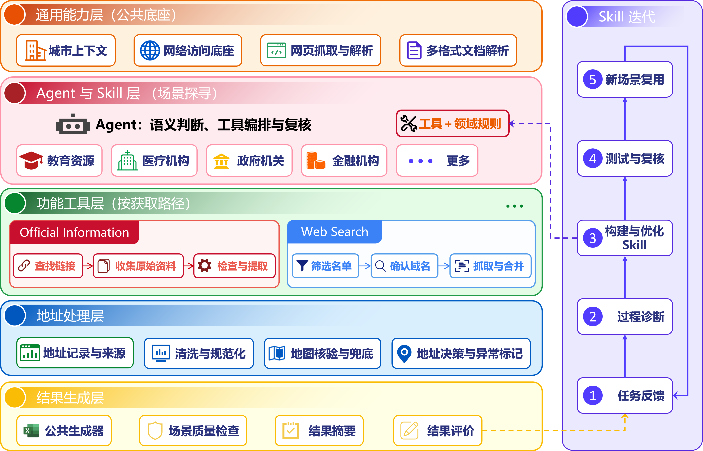
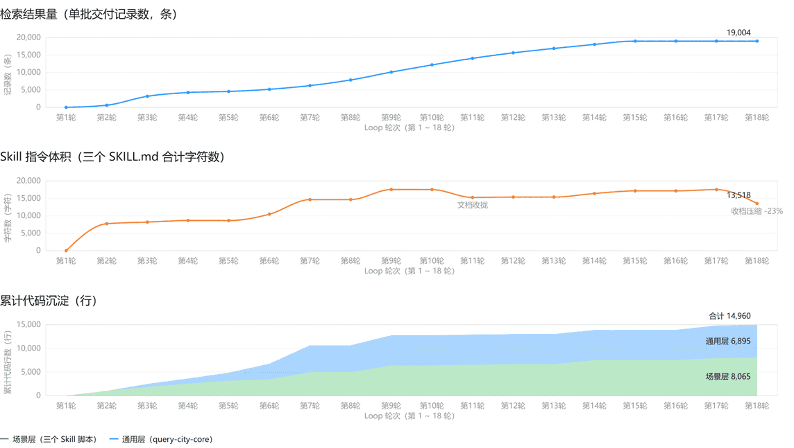

# 交接报告

> 本报告记录城市公共资源检索项目的已交付能力、广州实测产出、质量验证与后续交接边界。方法论部分说明这些能力的迭代方式；运行产物是本报告中数据结论的唯一依据。

## 项目摘要

项目将面向城市的开放式公共信息检索，沉淀为三类可复用 Agent Skill，并以 `query-city-core` 提供城市解析、政府来源采集、地址处理、工作簿输出和交付质量闸门等公共能力。

| 交付场景 | 交付对象 | 核心特点 |
| --- | --- | --- |
| 基础教育 | 直接下级行政单位内的非高校学校及地址 | 政府来源分学段覆盖、扫描件视觉转录、提取计划复核与异常校分表。 |
| 医疗机构 | 持证、登记或备案医疗机构及地址 | 政府平台注册分页采集、跨目录去重、按最终物理地址归区。 |
| 高等教育 | 城市内普通高校及校区地址 | 教育部名单筛选、官网域名确认、校区页面抓取和地图验证。 |
| 公共核心层 | 三类场景的共享组件 | 城市标准化、官网/附件采集、地址规范化、地图校验、Excel 输出与质量闸门基础设施。 |

业务规则留在各 Skill 中，公共层不依赖学校、医疗机构等具体业务语义。这使来源采集、地址处理与交付校验可以复用，而不同领域仍可保留各自的来源口径和覆盖规则。

全部代码位于 `Resource-retrieval` 仓库的 `main` 分支



## 广州实测产出

| 场景 | 覆盖范围 | 主记录/输出记录 | 地址来源 |
| --- | :--- | :--- | --- |
| 高等教育 | 广州市高校及校区 | 145 条主记录 | 政府资料  2,685 条  地图补充  927 条 |
| 基础教育 | 11 个直接下级行政单位 | 3,668 条主记录 | 政府资料  9,767 条  地图补充  10 条 |
| 医疗机构 | 11 个直接下级行政单位 | 9,777 条输出记录 | 官网提取  136 条  地图补充  9 条 |

产出结构化POI数据

-  [基础教育学校查询_广州市_2026-09-04.xlsx](..\output\广州市\2026-09-04\Basic_Education\153542\基础教育学校查询_广州市_2026-09-04.xlsx) 
-  [高校建筑查询_广州市_2026-09-04.xlsx](..\output\广州市\2026-09-04\Higher_Education\111158\高校建筑查询_广州市_2026-09-04.xlsx) 
-  [医疗机构信息_广州市_2026-09-04.xlsx](..\output\广州市\2026-09-04\Medical_Institutions\153440\医疗机构信息_广州市_2026-09-04.xlsx) 

## 工程化成果与可追溯链路

三类场景均以“原始证据可回看、处理中间件可复核、最终工作簿可交付”为原则组织目录：

```text
官方网页 / 附件 / 官方平台响应
        ↓
来源清单与本地原始文件（government_source.json、sources/）
        ↓
已复核的提取计划（extraction_plan.json）
        ↓
结构化地址记录（address_records.json）
        ↓
地址规范化与地图/官方证据处理（processed_address_records.json）
        ↓
区级工作簿、城市总表与 quality_report.json
```

- 基础教育质量闸门检查来源清单和学段覆盖说明、提取计划复核状态，以及地址记录的阶段合法性。
- 医疗机构质量闸门以政府平台注册数量为下界，检查大类覆盖、全量来源和区级输出是否满足约束。
- 高等教育质量闸门检查最终地址中的联系电话等残留文本，以及同校同路“有门牌/无门牌”并存的重复记录。
- 公共层包含来源文件和详情页采集、同主机节流、浏览器/直连兜底、结构化地址处理、统一 Excel 样式和公共质量闸门框架。

## 代码仓与工程资产

### 仓库概况

| 项目 | 内容 |
| --- | --- |
| 仓库地址 | `git@github.com:YaoHui-Wu06022/Resource-retrieval.git` |
| 提交规模 | 21 次提交，时间跨度 2026-08-27 ~ 2026-09-17 |
| 跟踪文件 | 157 个（三个 Skill 57、公共核心层 65、文档 8、输出样本 25、仓库根 2） |
| Python 规模 | 28,113 行（业务脚本 15,273 行 + 测试 12,840 行） |
| 测试资产 | 42 个测试文件、63 个 TestCase 类、539 个测试用例 |

### 目录结构

```text
search_city_source/
├── .agents/skills/                     三个场景 Skill，各自独立可跑
│   ├── query-city-basic-education/     基础教育：分学段政府来源检索、扫描件转录、提取计划复核
│   ├── query-city-medical-institutions/ 医疗机构：注册平台分页采集、城市级去重分桶
│   └── query-city-universities/        高等教育：教育部名单筛选、官网校区页抓取、地图验证
├── packages/query-city-core/           公共核心层（可安装包 query-city-core 0.1.0）
│   ├── src/query_city_core/            address/、official/、web/ 三个子包 + 通用组件
│   └── tests/                          22 个测试文件
├── doc/                                交接报告、三份操作手册、方法论提示词与图表
├── output/                             广州实测产出（仅跟踪最终 Excel）
└── AGENTS.md                           编码规范
```

每个 Skill 目录结构一致：`SKILL.md`（能力与流程定义）、`AGENTS.md`（局部约定）、`scripts/`（可执行脚本与 `tests/`）、`references/`（来源与结果格式）、`assets/`（固定资产，仅高校有）、`requirements.txt`。

### 公共核心层模块

| 子包/模块 | 职责 |
| --- | --- |
| `address/` | 城市标准化（`city.py`）、地址规范化（`normalize.py`）、地址处理编排（`process.py`）、地图校验（`verify.py`、`amap_client.py`） |
| `official/` | 来源读取器（HTML/PDF/表格/MinerU 扫描件/视觉）、栏目链接与来源文件收集、通用提取引擎 |
| `web/` | 官网页面抓取（`fetch_official_page.py`）、域名现用性探测（`probe_domains.py`） |
| `excel_style.py`、`excel_output.py` | 工作簿统一格式、地址输出列、原子保存与自动复核 |
| `host_gate.py` | 同主机并发上限与最小请求间隔节流 |
| `access.py` | HTTP 直连兜底（urllib/curl）、访问审计、浏览器指纹常量 |
| `quality_gate.py` | 公共质量闸门框架 |
| `env_utils.py`、`io_utils.py` | `.env` 配置读取、JSON 读写 |

### 环境与安装

- 要求 Python ≥ 3.10
- 公共层以 editable 模式安装：`pip install -e packages/query-city-core`；可选依赖 `[web]`（playwright）与 `[excel]`（openpyxl）。
- 命令行入口由 `pyproject.toml` 注册：`query-city-resolve-city`、`query-city-process-addresses`。
- 三个 Skill 各自维护 `requirements.txt`，只锁 `query-city-core` 版本，其余依赖在各自 `SKILL.md` 中声明。
- 密钥经 `.env` 或环境变量注入：`AMAP_KEY`（地址/地图）、`MINERU_ACCESS_KEY`/`MINERU_SECRET_KEY`（扫描件解析）；`.env` 不入库。

### 版本与变更边界

- `output/` 仅跟踪最终 Excel 报告；中间过程文件（`government_source.json`、`extraction_plan.json`、`address_records.json`、`processed_address_records.json` 等）由 `.gitignore` 排除，需在原始运行目录中回看。
- 公共层不依赖任何 Skill 的业务语义，场景词表由 Skill 注入；公共层接口变更时需同步三个 Skill 的测试。

## 验证证据与复现入口

本次交接前按目录独立执行测试，结果如下：

| 测试范围 | 结果 |
| --- | --- |
| 公共核心层 | 263 passed，4 subtests passed |
| 基础教育 | 87 passed，33 subtests passed |
| 医疗机构 | 28 passed |
| 高等教育 | 161 passed，2 subtests passed |
| 合计 | 539 passed，39 subtests passed |

运行入口与字段约定由下列文档维护，详细命令不在本报告重复：

- [基础教育查询操作手册](基础教育查询操作手册.md) 与 [Skill 定义](../.agents/skills/query-city-basic-education/SKILL.md)
- [医疗机构查询操作手册](医疗机构查询操作手册.md) 与 [Skill 定义](../.agents/skills/query-city-medical-institutions/SKILL.md)
- [高校查询操作手册](高校查询操作手册.md) 与 [Skill 定义](../.agents/skills/query-city-universities/SKILL.md)



## 方法论与研究依据

针对**缺少完备测试集、尚未形成明确评价指标、且任务场景需要持续扩展**的 Agent Skill，采用：**场景探索 + 轨迹分析 + 反馈反思 + Skill 优化 + 回归测试**进行持续迭代

因为当前大模型在完成功能过程中擅长对单个任务持续打补丁，所以需要让大模型在执行过程中不断识别：

- 当前 Skill 的能力边界与失败模式；
- 后续值得继续探索和扩展的能力方向。
- 可以沉淀为 Skill / 子 Skill 的稳定流程

整体形成如下 Loop

```
场景探索 → Skill 执行 → 结果校验 → 轨迹分析 → 问题归因 → Skill 优化 → 测试沉淀 → 回归验证 → 新场景探索
```

### 初始化

初始化阶段分两种起点：从空白开始，或已有单一场景可复用。

#### 空白起始

在没有现成 Skill 的情况下，不预先进行完整人工编排，而是先让大模型针对一个单一目标任务进行拆解，包括：

- 主要执行步骤；
- 所需信息；
- 已有 API / Tool；
- 可以进一步封装的公共能力

在 Prompt 中主动加入环境探索要求

```
根据当前任务主动探索可用信息源和执行路径，分析完成任务需要哪些步骤、工具和数据，并识别可以进一步封装为 Skill 的可复用能力
```

首先得到一个初步可执行方案，可以类比为后续迭代的“初始化状态”

因为目前大模型对于数据的理解可能没有那么全面，可以适当人工介入大模型设计的流程

#### 已完成单一场景

当 Skill 已经可以稳定完成某类任务后，下一步重点从“解决当前任务”转向“扩展 Skill 的能力边界”。

首先判断新任务与已有任务是否具有可复用关系，并在 Prompt 中加入：

```
查找当前执行过程中可以复用的组件，区分通用场景与特异性场景，并分析现有能力可以向哪些相邻场景扩展。
```

目标是避免 Skill 针对单一场景不断增加特殊逻辑，而是逐步提取通用组件和场景特异组件

参考

> - [Voyager | An Open-Ended Embodied Agent with Large Language Models](https://voyager.minedojo.org/) 
> - [SkillWeaver: Web Agents can Self-Improve by Discovering and Honing Skills.](https://github.com/OSU-NLP-Group/SkillWeaver) 

### 分批次探查

当任务包含大量目标对象时，不一次完成全部任务，类似深度学习，采用小批量 Batch 的方式逐步进行场景探索。

每个 Batch 独立完成：

**任务执行 → 轨迹记录 → 错误统计 → 原因分析 → Skill 优化 → 回归验证**

完成一个 Batch 后，再使用新的 Batch 测试修改后的 Skill

不同 Batch 同时承担两个角色

- **训练/探索数据**：用于暴露未知场景和 Failure Pattern
- **验证数据**：判断前一轮修改是否具有泛化能力，而不是只解决上一批 Case

这个设计和 [EvoSkill: EvoSkill](https://github.com/sentient-agi/EvoSkill) 中的研究模式相似，不过论文中有一个专门的验证集

在 [SkillOpt](https://microsoft.github.io/SkillOpt/) 微软这篇论文中其实提到了类似深度学习冻结SKill这件事，可控制地修改/删除/添加Skill 文本，本次还没落实

每个 Batch 执行完成后，由 Agent 对**整批执行轨迹**进行分析，而不是发现一个错误就增加一条特殊规则

对轨迹的总结主要是这几篇：

- [GEPA: Reflective Prompt Evolution Can Outperform Reinforcement Learning](https://proceedings.iclr.cc/paper_files/paper/2026/hash/0e9e708b6f48e14fd0ac29e167413f76-Abstract-Conference.html)
- [Reflexion: Language Agents with Verbal Reinforcement Learning](https://arxiv.org/abs/2303.11366)
- [ExpeL: LLM Agents Are Experiential Learners ](https://ojs.aaai.org/index.php/AAAI/article/view/29936)

### 多路结果校验

很多开放式任务不存在完整测试集或明确 Ground Truth，不能只根据 Skill 是否“成功执行”判断结果正确性

适合能够用LLM分析判断或者已经有一小撮准确标签的数据(few-shot)

以下三个路径分三个Agent对话窗口分别执行，避免上下文污染

**路径 A：Skill 执行**

让Skill按照目前已有的流程执行工具获得结果

**路径B：LLM 判断**

根据原始问题、检索信息和执行轨迹重新进行判断。

**路径C：辅助数据源**

如果存在相对可靠的第三方数据源，则进一步加入交叉验证。

例如地址任务可以比较：

```
Skill 检索结果
↕
LLM 独立判断(视觉)
↕
高德地图结果
```

当三路结果存在冲突时，进一步回看：

- 信息来源；
- 查询过程；
- 工具调用轨迹。

评价对象不仅是最终结果，还包括整个执行过程

### 从 Failure 中沉淀能力

对于发现的问题，不优先采用 Case-by-Case Patch，而是先判断问题所属层级

- 流程层问题：整体 Workflow 是否合理
- 组件层问题：是否缺少工具能力
- 规则层问题：使用条件和判断规则是否完整

如果多个 Failure 可以由同一个能力解决，则应优先将其沉淀为通用组件或 Skill，而不是分别增加特殊规则

每轮探索中发现的重要问题，需要进一步沉淀为测试用例，重点保留：

- 曾经失败的 Case；
- 容易产生歧义的边界 Case；
- API 异常 Case；
- 新增 Skill 对应的代表性 Case。

新的 Skill 修改完成后，至少需要满足两个条件：

- 条件 1：历史能力不退化，已有 Test 需要继续通过。
- 条件 2：新问题被解决，本轮新增 Case 需要通过。

形成：

```
探索数据
→ Failure Case
→ Test Case
→ Skill Update
→ Regression Test
```

的闭环，避免后续各类改动破坏原有功能

最新关于 Self-Evolving Skills 的研究已经发现：更多轮迭代并不意味着能力会稳定、单调提升

在多轮 Skill Evolution 实验中发现，有效提升往往是稀疏出现的，因此需要 validation-based selection

> [Rethinking Self-Evolving Agent Skills: Feedback Dynamics over Multiple Rounds](https://arxiv.org/abs/2608.02636)

### 独立 Agent 审核

完成若干轮 Batch 之后，不继续让当前对话中的 Agent 无限制修改 Skill，而启动一个新的 Agent 进行独立 Review

Review 输入主要包括：

- 当前 Skill；
- Failure Case；
- 执行轨迹；
- 已完成优化。

重点检查：

- 当前优化方向是否正确；
- 是否存在过度针对局部 Case 的修改；
- 是否存在新的能力缺口。

如果没有明显问题，再推送形成版本往下继续

要求 Review Agent：

```
基于当前能力边界，探索下一步仍需完善的场景、能力缺口或待实现功能。
```

从而进入下一轮 Exploration

这里依然是EvoSkill的思想，分多个Agent，但是子Agent之前尝试的时候失败了，不清楚是不是codex + deepseek的问题，最直接的就是新开对话框

通过独立反馈帮助 Skill 演化，在缺乏直接 Ground Truth 的条件下提高生成 Skill 的可靠性

> 新开对话框或者说启用子Agent和目前LLM的机制有关，因为目前LLM对错误还有优化方向的把控没有很准确，容易掉入局部，但是用新对话就能减少这个问题
>
> 保留State，但是抛弃History，这一部分目前更多来自项目实践经验，而不是直接复现某一篇论文中的设计

### 多轮探查

单轮任务在完成第一轮分析后，新增信息通常会快速减少。

因此后续不能只重复执行相同任务，还需要：

- 扩大新的 Batch；
- 更换不同类型的场景；
- 让 Agent 主动设计额外探查任务；
- 针对已有能力边界构造新的问题。

否则随着同一批任务被逐渐解决，可用于改进的有效信息会迅速减少，即 Evolution Gradient 逐渐消失

### 总结

最终可以将当前的 Skill 自迭代方法总结为：

```
初始化 Skill
      ↓
Batch 场景探索
      ↓
执行 + 保存 Trajectory
      ↓
多路结果校验
      ↓
Failure Pattern 分析
      ↓
流程 / 组件 / 规则优化
      ↓
Failure 沉淀为 Test
      ↓
Regression Test
      ↓
接受修改 / 回退
      ↓
独立 Agent Review
      ↓
寻找新的能力边界
      ↓
进入下一轮 Batch
```

目前来看场景还需要人补充引导一下
